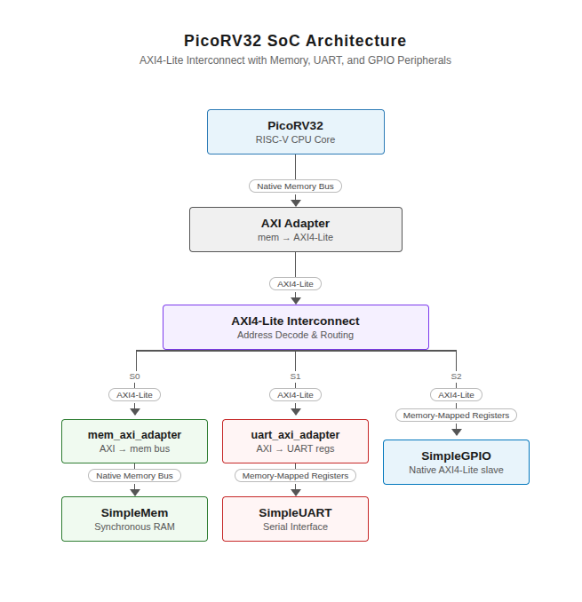

# Tetrel-RISCV

Tetrel-RISCV is an RV32IMC SoC built around the `picorv32` core. The project focuses on clarity and correctness first, with simulation-driven development using QuestaSim and Xcelium.

## Overview

[architecture diagram](attachments/soc_diagram.html)



Main directory: `/Tetrel-RISCV/`

Folder structure:

```
/Tetrel-RISCV/
├─ SoC/
│  ├─ firmware/          # C firmware for the SoC
│  │  ├─ src/            # C source files
│  │  ├─ asm/            # start.S (startup code)
│  │  ├─ build/          # Intermediate files (.o, .elf)
│  │  ├─ hex/            # Final .hex outputs loaded by simplemem
│  │  ├─ linker.ld       # Linker script
│  │  └─ Makefile        # Build system
│  ├─ sourcecode/
│  │  ├─ rtl/            # SoC RTL (core, bus, peripherals)
|  |  └─ tb/             # Testbench files
│  └─ sim/               # Simulation setup (run.do, configs)               
├─ README.md
└─ SoC_progress/         # Progress log
```

---

## Toolchain

Install the RISC-V GCC toolchain:

```bash
sudo apt install gcc-riscv64-unknown-elf
```

- Compiler: `riscv64-unknown-elf-gcc`
- Target arch: `RV32IMC` (`-march=rv32imc -mabi=ilp32`)

### Building firmware

```bash
cd SoC/firmware
make clean
make FILE=smoke_test
```

This compiles your C program and produces a `.hex` file in `SoC/firmware/hex/`.

### Manual compile commands

```bash
# Compile to ELF
riscv64-unknown-elf-gcc -march=rv32imc -mabi=ilp32 -nostdlib \
  -T linker.ld -o build/smoke_test.elf asm/start.S src/smoke_test.c

# Convert ELF to HEX
riscv64-unknown-elf-objcopy -O verilog --verilog-data-width=4 \
  build/smoke_test.elf hex/smoke_test.hex && \
awk '/^@/{print; next} {for(i=1;i<=NF;i++) print $i}' \
  hex/smoke_test.hex > hex/smoke_test.hex.tmp && \
mv hex/smoke_test.hex.tmp hex/smoke_test.hex
```

---

## Tooling Notes

For low-level validation and experimentation:

- [RISC-V Online Assembler - racerxdl](https://riscvasm.lucasteske.dev/#)
    - [github repo](https://github.com/racerxdl/riscv-online-asm)
- [RISC-V Instruction Encoder / Decoder - LupLab](https://luplab.gitlab.io/rvcodecjs/#q=40628433&abi=false&isa=AUTO)
- [RISC-V ISA Reference - lhtin](https://lhtin.github.io/01world/app/riscv-isa/?xlen=32)
    - [github repo](https://github.com/lhtin/01world/tree/main/app/riscv-isa-dev)

[active progress log](https://github.com/anbu-05/Tetrel-RISCV/wiki/Dev-logs)

You can find the progress log before 2026 in: [/SoC_progress/progress/Progress.md](https://github.com/anbu-05/Tetrel-RISCV/blob/main/SoC_progress/progress/Progress.md)

---

## Running the SoC

1. Open a terminal in:

   ```
   Tetrel-RISCV/SoC/sim/
   ```

2. Open `run.do` and edit waveform selections if needed.

   **Important:** make sure the simulation is launched with:

   ```
   -voptargs="+acc"
   ```

   Without this, Questa may not expose internal signals and memory correctly.

3. Place your program hex file in:

   ```
   Tetrel-RISCV/SoC/firmware/hex/
   ```

4. The hex filename is set in `top.sv`:

   ```systemverilog
   simplemem #(
       .PROGRAM_HEX("../firmware/hex/smoke_test.hex")
   ) mem ( ... );
   ```

5. Launch QuestaSim:

   ```bash
   vsim &
   ```

6. Inside Questa, confirm the working directory:

   ```tcl
   pwd
   ```

   It should be:

   ```
   Tetrel-RISCV/SoC/sim
   ```

7. Run the simulation:

   ```tcl
   do run.do
   ```

---

## Memory Map

```
ROM   : 0x00000000 – 0x0000FFFF  (64 KiB)        program code
RAM   : 0x00010000 – 0x00017F7F  (32 KiB - 128 B) stack and variables
SIG   : 0x00017F80 – 0x00017FFF  (128 B)          signature registers (reserved)
UART  : 0x00018000 – 0x0001800B  (12 B)           serial UART
GPIO  : 0x00020000 – 0x00020007  (8 B)            general purpose I/O
```

Program execution starts at `0x00000000`.

---

## AXI Mux and Address Offsetting

The `axi_interconnect` is the bus interconnect. It sits between the CPU and all peripherals, routing transactions to the right slave based on the address.

Each slave is assigned an origin and a length in the interconnect's parameters:

```systemverilog
axi_interconnect #(
    .SLAVE0_ORIGIN(32'h00000000),  // SRAM (ROM + RAM)
    .SLAVE0_LENGTH(32'h00018000),
    .SLAVE1_ORIGIN(32'h00018000),  // UART
    .SLAVE1_LENGTH(32'h0000000c),
    .SLAVE2_ORIGIN(32'h00020000),  // GPIO
    .SLAVE2_LENGTH(32'h00000008)
) interconnect ( ... );
```

**Address offsetting:** before forwarding a transaction to a slave, the mux subtracts that slave's origin from the address. So a CPU access to `0x00018004` (UART DIV register) arrives at the UART peripheral as `0x00000004`.

This means every peripheral can assume its own registers start at `0x00000000`. The peripheral doesn't need to know where it lives in the system address space — that's entirely the mux's concern.

**Adding a new peripheral** follows the same pattern as existing slaves:
1. Add `SLAVE3_ORIGIN` and `SLAVE3_LENGTH` parameters to `axi_interconnect`
2. Add an `in_s3()` range check function
3. Add a `slave3_axi` port
4. Add the `slave3` default assignments and routing branches (one per AXI channel) — same structure as slave1 and slave2
5. Wire it up in `top.sv`

The peripheral's own RTL just uses offsets from `0x0` with no knowledge of the system map.

---

## UART Registers (`0x00018000`)

| Offset | Name   | Description                                     |
|--------|--------|-------------------------------------------------|
| `+0x0` | STATUS | Bit 0 = TX ready (1 = ready, 0 = busy)         |
| `+0x4` | DIV    | Baud rate divisor. `divisor = clk_freq / baud` |
| `+0x8` | DAT    | Write: TX byte. Read: RX byte                  |

**Baud rate examples:**

| Clock  | Baud   | Divisor |
|--------|--------|---------|
| 50 MHz | 115200 | 434     |
| 50 MHz | 9600   | 5208    |
| 1 MHz  | 115200 | 8       |

> In simulation set `DIV = 1` so each UART bit takes 1 clock cycle. This is fast to simulate but won't work on real hardware.

---

## GPIO Registers (`0x00020000`)

| Offset | Name | Description                                       |
|--------|------|---------------------------------------------------|
| `+0x0` | DATA | Write: output pin values. Read: current pin state |
| `+0x4` | DIR  | Pin direction per bit. `1` = output, `0` = input  |

**Notes:**
- On reset all pins default to input (`DIR = 0`)
- Always set `DIR` before writing `DATA`
- Reading `DATA` on an output pin returns the value you wrote
- Reading `DATA` on an input pin returns the value on the physical pin

---

## Signature Registers

The top 128 bytes of RAM (`0x00017F80 – 0x00017FFF`) are reserved as 32 signature registers. These are used by C firmware to communicate test results to the testbench without needing UART or any other peripheral.

The linker script sets `_stack_top = 0x00017F80` so the stack never grows into this region.

### How it works

- The C program writes to signature slots as tests pass or fail.
- The testbench watches for **slot 31** (`SIG_DONE`) to be written, then reads all 32 slots directly from memory and prints results.
- The testbench is completely generic — it knows nothing about what each slot means. Slot meanings are defined only in the C program.
- If the test does not complete within the timeout, the testbench prints whatever has been written so far and reports `TIMEOUT`.

### Slot layout

| Slot | Address      | Notes            |
|------|--------------|------------------|
| 0    | `0x00017F80` | general purpose  |
| 1    | `0x00017F84` | general purpose  |
| …    | …            | …                |
| 30   | `0x00017FF8` | general purpose  |
| 31   | `0x00017FFC` | `SIG_DONE` only  |

Slot 31 is reserved. Writing `0xDEADBEEF` to it tells the testbench the test is complete.

### Value conventions

| Value        | Meaning                         |
|--------------|---------------------------------|
| `0x00000000` | UNUSED — slot was never written |
| `0xA0xxxxxx` | PASS — upper nibble is `0xA`    |
| `0xBADxxxxx` | FAIL — upper 12 bits are `0xBAD`|
| `0xDEADBEEF` | DONE — slot 31 only             |

### Using signatures in C

Include `signatures.h` from `firmware/src/`:

```c
#include "signatures.h"

// Pass: write any value with upper nibble 0xA
SIG(0) = EXP_SIG(0xADD);   // tag is any 28-bit value you choose

// Fail: write a BAD value
SIG(0) = BAD_SIG(0);        // convention: pass the slot number

// Always end with this
SIG_DONE = DONE_VAL;
```

**Macros in `signatures.h`:**

| Macro          | Value                          |
|----------------|--------------------------------|
| `SIG(n)`       | pointer to slot n              |
| `SIG_DONE`     | pointer to slot 31             |
| `EXP_SIG(tag)` | `0xA0000000 \| tag`            |
| `BAD_SIG(n)`   | `0xBAD00000 \| n`              |
| `DONE_VAL`     | `0xDEADBEEF`                   |

### Testbench output

```
---- Signature Results ----
  SIG[00] PASS  (0xa0000add)
  SIG[01] PASS  (0xa00000a1)
  SIG[02] UNUSED
  ...
  SIG[31] DONE  (0xDEADBEEF)
---------------------------
```

---

## Writing Firmware in C

A minimal C program for this SoC needs two files alongside your `.c` source:

**`asm/start.S`** — runs before `main()`, sets up the stack:
```asm
.section .text
.global _start

_start:
    la sp, _stack_top
    call main

loop:
    j loop
```

**`linker.ld`** — tells the linker where to place code and data in memory:
```
ROM (rx)  : ORIGIN = 0x00000000, LENGTH = 64K   ← code goes here
RAM (rwx) : ORIGIN = 0x00010000, LENGTH = 32K   ← stack and variables
```

`_stack_top` is set to `ORIGIN(RAM) + LENGTH(RAM) - 128` to keep the stack out of the signature region.

---

## Notes and Limitations

- No interrupt support yet
- No CSR handling
- Peripheral set is intentionally minimal
- Design favors readability and explicit structure over performance